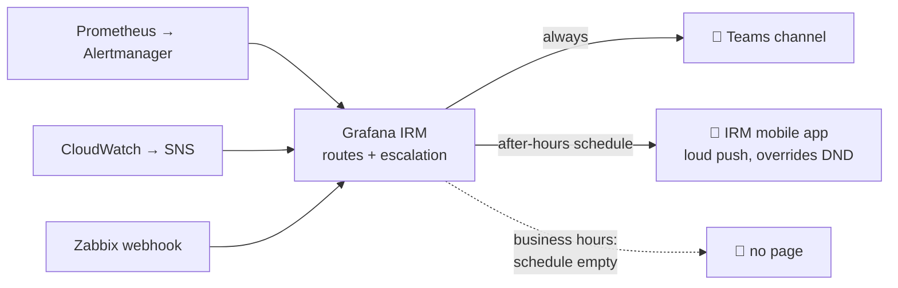

<div align="center">

# 📟 Zero-Cost After-Hours On-Call with Grafana IRM

**Page engineers only at night and on weekends, send every alert to Microsoft Teams 24x7, and pay $0.**


</div>

---

## 💰 Cost & free-tier limits (read this first)

> ### ✅ Total monthly cost: **$0** for a rota of up to **3 engineers**
>
> ### ⚠️ The main limit: **3 active IRM users per month** on Grafana Cloud Free.
> A 4th person moves you to **Pro: $19/month platform fee + $20 per extra active IRM user**.

| What | Free tier | Notes |
|---|---|---|
| **Active IRM users** | **3 / month** | ⚠️ The limit that matters. Explained below. |
| Schedules, rotations, overrides, shift swaps | ✅ Included | Unlimited schedules |
| Escalation chains & routes | ✅ Included | Unlimited |
| **Mobile app push** (overrides Do Not Disturb) | ✅ Included, $0 | Main paging channel in this design |
| Built-in phone call & SMS | ✅ Included, no per-message cost | Optional. Number must be verified; delivery varies by country/carrier; Grafana may throttle abnormal volume |
| Outgoing webhooks (Teams, Slack, anything) | ✅ Included | Teams gets every alert 24x7 |
| Alert ingestion | 300 alerts / 5 min **per integration**, 900 / 5 min **per org** | Send only critical alerts; group at the source |
| REST API | 300 requests / min per token | Plenty for the scripts here |
| Grafana dashboards (visualisation users) | 3 active users / month | Separate from IRM users |
| Metrics / logs / traces (if you use them) | 10k series · 50 GB logs · 50 GB traces · 14-day retention | Not needed for on-call |
| Support | Community only | No SLA from Grafana on Free |

**Who counts as an "active IRM user"?** Anyone who, in that month:
- is in an on-call **schedule** or **escalation chain**, or
- **acknowledges / resolves / silences** an alert group, or changes IRM config.

People who only *read* alerts in Teams **don't count**. Put 3 engineers in the
rota and let everyone else follow along in the Teams channel.

**Everything else in the stack is also $0:**

| Component | Cost |
|---|---|
| Grafana IRM mobile app (Android / iOS) | $0 |
| Microsoft Teams Workflows / incoming webhook | $0 (existing M365 licence) |
| Amazon SNS → HTTPS | $0 within the AWS free tier for normal alert volume |
| Prometheus / Alertmanager / Zabbix | $0 (self-hosted, you already run them) |
| Third-party voice-call APIs | **Not used**. They need a paid caller ID / DID number + KYC. |

> Prices and limits were checked in September 2026 on
> [grafana.com/pricing](https://grafana.com/pricing/) and the
> [IRM rate-limits docs](https://grafana.com/docs/grafana-cloud/alerting-and-irm/irm/reference/rate-limits/).
> Check them again before you rely on them.

---

## 💡 The problem

- A small ops team had alerts from **Prometheus, CloudWatch and Zabbix**.
- During office hours everyone watches Teams, so **phones must stay quiet**.
- At night and on weekends a critical alert **must wake someone up**, and
  escalate if they don't respond.
- Budget for PagerDuty/Opsgenie-style tooling: **zero**.

## ✅ The solution in one picture



**The trick:** schedules contain *only* after-hours shifts. During business
hours the escalation step "notify whoever is on-call" finds nobody, so no one is
paged. Teams still gets the card because it hangs off the alert group, not the
escalation. You need no cron jobs, no time-based scripts and no paid features.

➡️ **Full flow diagrams:** [docs/ARCHITECTURE.md](docs/ARCHITECTURE.md), covering
end-to-end flow, the business-hours decision, weekly coverage, the escalation
timeline, multi-environment routing and the pause switch.

### Escalation (after hours)

| Time | Action |
|---|---|
| T+0 | 💬 Teams FIRING card |
| T+6 min | 📱 Tier 1 paged (grace period lets flapping alerts auto-resolve first) |
| T+16 min | 📱 Tier 2 paged if nobody acknowledged |
| T+26 min | 📱 Tier 3 paged |
| T+36 min | 📱 Everyone paged together |
| Resolve | 💬 Teams RESOLVED card |

All timings, tiers and business hours are set in `config.yaml`.

---

## 📁 Repository layout

```
├── README.md
├── config.example.yaml        # business hours, timezone, tiers, environments
├── .env.example               # API URL + token + Teams URL (placeholders only)
├── requirements.txt
├── scripts/
│   ├── bootstrap_oncall.py    # builds schedules, chains, integrations, routes, Teams webhooks
│   ├── paging_toggle.py       # pause / resume all paging with a JSON backup
│   ├── who_is_on_call.py      # shows who is on-call right now
│   ├── send_test_alert.sh     # fires / resolves a synthetic alert
│   └── oncall_api.py          # small API client (reads secrets from .env)
├── templates/
│   ├── teams-firing.json.j2   # Adaptive Card for FIRING
│   └── teams-resolved.json.j2 # Adaptive Card for RESOLVED
├── examples/
│   ├── alertmanager.yml       # Prometheus → IRM
│   ├── cloudwatch-sns.md      # CloudWatch → SNS → IRM
│   └── zabbix-webhook.md      # Zabbix → IRM
└── docs/
    ├── ARCHITECTURE.md        # flow diagrams + cost
    ├── UI-SETUP.md            # every click needed in the Grafana IRM UI
    └── TROUBLESHOOTING.md     # real production gotchas and fixes
```

---

## 🚀 Quick start

### 1. UI steps (one-time, about 20 min): [docs/UI-SETUP.md](docs/UI-SETUP.md)
1. Create a **Grafana Cloud Free** stack.
2. Invite your **3** on-call engineers (Editor role).
3. Create an **IRM API token**.
4. Each engineer: install the **Grafana IRM app**, scan the QR code, enable
   **Override DND / Critical Alerts**, and set *Important* notification rules.
5. Create a **Teams webhook** (Workflows → "Post to a channel when a webhook
   request is received").

### 2. Configure
```bash
git clone https://github.com/priyankagupta7679/grafana-irm-oncall-zero-cost.git
cd grafana-irm-oncall-zero-cost
pip install -r requirements.txt

cp .env.example .env                 # add API URL, token, Teams URL
cp config.example.yaml config.yaml   # set timezone, business hours, engineer emails
```
Both `.env` and `config.yaml` are in `.gitignore`, so your secrets stay local.

### 3. Build
```bash
python scripts/bootstrap_oncall.py --dry-run   # shows the plan, changes nothing
python scripts/bootstrap_oncall.py             # creates everything (safe to re-run)
```
The script prints one URL per integration. Wire your sources to them using
[`examples/`](examples/).

### 4. Verify
```bash
python scripts/who_is_on_call.py                               # office hours → "nobody"
./scripts/send_test_alert.sh "<alertmanager-url>" firing app-a  # Teams card (+ page after hours)
./scripts/send_test_alert.sh "<alertmanager-url>" resolved app-a
```

### 5. Day-2 operations
```bash
python scripts/paging_toggle.py pause                          # maintenance: phones silent, Teams still on
python scripts/paging_toggle.py resume backups/routes_<time>.json
```
Holidays and swaps: add an **override** on the schedule in the UI, or swap
shifts from the mobile app.

---

## 🧠 Design decisions

| Decision | Why |
|---|---|
| Business-hours logic in **schedules**, not at the alert source | Teams still gets every alert in office hours; only paging changes |
| **Mobile push** instead of phone calls | $0, no telecom KYC, rings through DND like a call |
| **6-minute** first wait | Most flapping alerts auto-resolve, so nobody is woken for nothing |
| **One schedule per tier** + an "everyone" schedule | Clear escalation order; the final step makes sure someone responds |
| **Calendar schedules** via API | Web-UI rotations can't be fully managed via the public API |
| `forward_all: false` + trigger templates on webhooks | Prevents raw-JSON cards and cross-project posting (both hit in production) |
| Pause switch with a JSON backup | Maintenance or billing problems never mean rebuilding config by hand |

## ⚠️ Limitations

- **3-person rota** on Free. For more people, upgrade to Pro or rotate who holds the 3 seats.
- **No SLA** on the Free tier. For regulated or contractual paging, pay for support.
- Mobile push depends on the phone: battery savers, no data connection or a
  revoked notification permission can block it. Test monthly.
- Built-in phone/SMS depends on country/carrier and can be throttled at abnormal volume.
- Alert storms above **300 alerts / 5 min per integration** are rate-limited. Group at the source.
- Grafana OnCall **OSS was archived in March 2026**, so self-hosting is no longer an option for mobile push.

## 🔒 Security

- No secrets in this repo. Everything comes from `.env` / `config.yaml` (git-ignored).
- Integration URLs and Teams webhook URLs **are credentials**. Anyone holding
  one can create alerts or post messages. Keep them in a secret manager and
  rotate them if leaked.
- Give the API token to automation only, and revoke it when you're done.

## 🤝 Contributing

Issues and PRs welcome, especially Slack templates, Terraform
(`grafana/grafana` provider) versions and more alert-source examples.

## 📄 License

[MIT](LICENSE)

---

<div align="center">

**Built by [Priyanka Gupta](https://github.com/priyankagupta7679)**, DevOps Engineer.
Star ⭐ the repo if it saves your team a paging bill.

</div>
