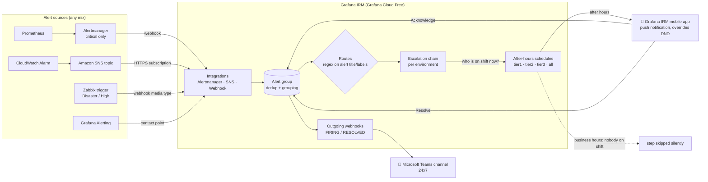
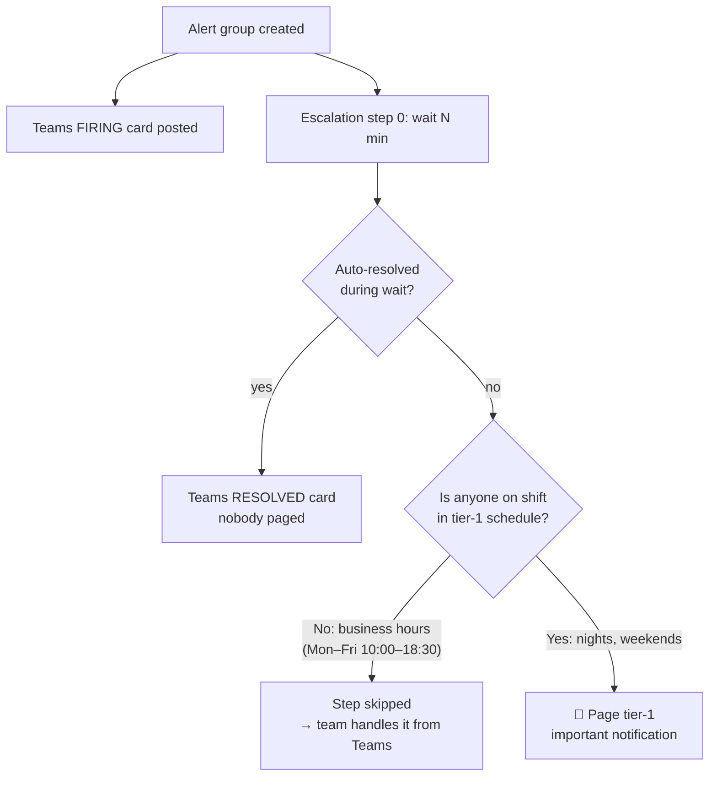
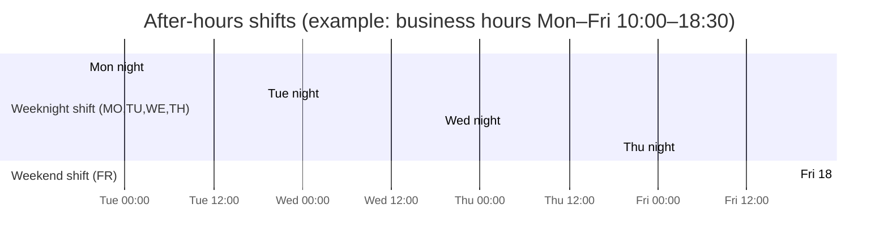
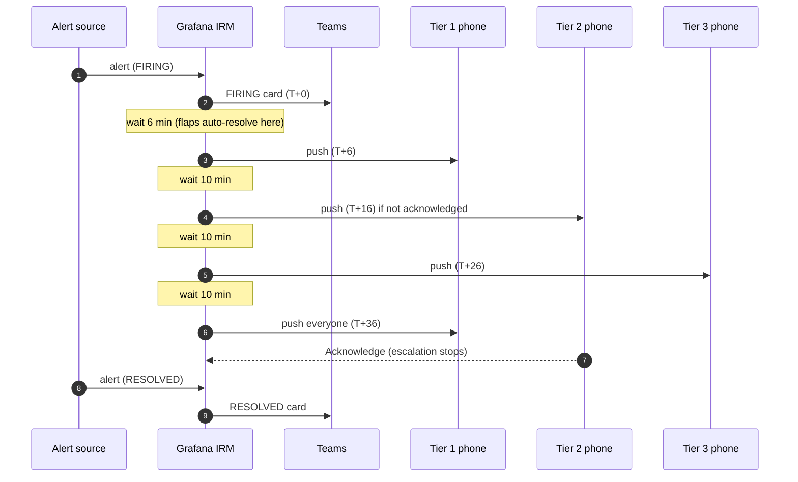
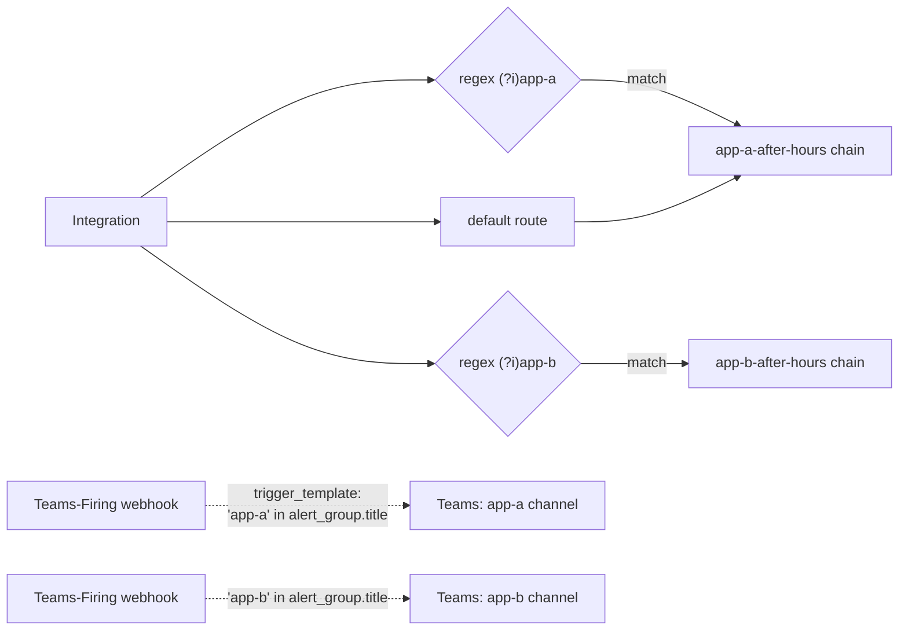
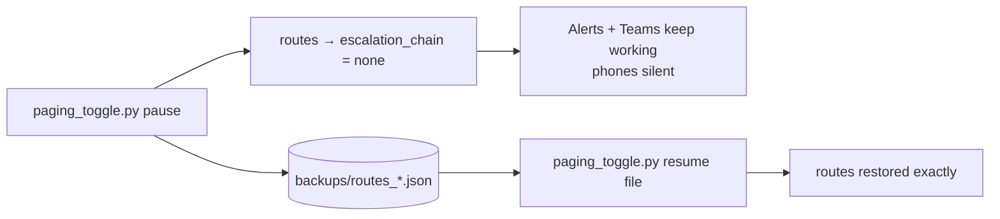

# Flow Architecture

All diagrams are Mermaid, so GitHub renders them directly.

## 1. End-to-end flow

**Key idea:** Teams notifications hang off the alert group itself, while phone
paging hangs off the escalation chain. They are independent, so every alert is
posted to Teams, and only the paging depends on the time of day.

## 2. Business-hours decision (no code, no cron)

The schedules contain **only** after-hours shifts. Inside business hours they are
empty, so `notify_on_call_from_schedule` finds nobody and moves on. No
time-based scripts, cron jobs or paid features are involved.

## 3. Weekly coverage

Two shifts per schedule cover every minute outside business hours:

`bootstrap_oncall.py` works these windows out from `business_hours` in
`config.yaml`, so you only change the times there.

## 4. Escalation timeline (after hours)

**Acknowledge** stops escalation. **Silence** only mutes it for a while, so tell the
team which one to use.

## 5. Multi-environment routing

- Non-default routes are evaluated first, in order. The default route catches the rest.
- With more than one Teams channel, give each outgoing webhook a **trigger
  template**. Without it, every webhook fires for every alert and projects cross-post.

## 6. Pause switch

## Cost breakdown

Full limits are in the [README](../README.md#-cost--free-tier-limits-read-this-first).

| Component | Cost |
|---|---|
| Grafana Cloud Free: IRM, schedules, escalation, mobile push | $0 for up to **3 active IRM users** per month |
| Grafana IRM mobile app (Android / iOS) | $0 |
| Microsoft Teams Workflows / incoming webhook | $0 with an existing M365 licence |
| Amazon SNS HTTPS deliveries | $0 within the free tier for normal alert volume |
| Alertmanager / Zabbix | $0 (self-hosted, already running) |
| Voice calls / SMS via a third-party telecom API | **Not used**. These need a paid caller ID / DID number. |
